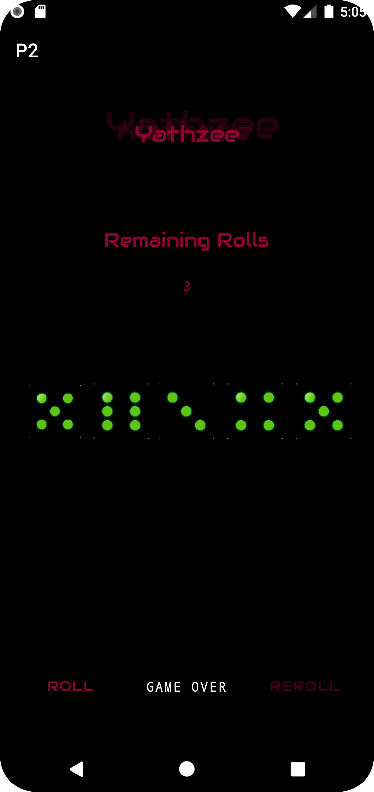

# CSC 214 APP PORTFOLIO | CHRISTOPHER BRUINSMA

## Mini-Projects

### Project One : Hello Android

This app was an introduction to Android Programming which made use of a simple Button, TextView, and XML-based set of strings to change the displayed text on the press of the main button. This application also made use of a custom set of colors

### Project Two : Club Counter

Persistence was key for the completion of this application which could be rotated any which direction and maintain the number of people in a nightclub — it is a small night club with a max occupancy of six. This app not only made use of a saved instance state, but a model class as well which would increment and decrement the number of individuals in the club.

### Project Three : Three-Card Monty

This application was all about animations. The animations used in the card game are to shuffle, spread, and flip the cards as well as to bring them back to the center after the game is played. There are two main buttons that are used for gameplay which are deactivated after their use. In creating the animations both value and object animators are used. This project also makes use of a model class for generating a random number associated with each card's outcome

### Project Four : Two Games in One

In this project there was an emphasis on fragments, there were two fragments in this application. One was for the Tik Tac Toe Game, and the other was for the Three-Card Monty game that had been created previously. These games are able to be switched dynamically as well.

### Project Five : Color Viewer

The name of the game here was RecyclerViews and ViewModels as well as a data class to store json data. This app also implemented CardViews that were dynamically bound and set to colors from a list of color values.

### Project Six : Tools App

Navigate, navigate, navigate. This was the goal with this application. There is a main view that contains three of the tools required for just about any purchase : a calculator, a search tab, and favorites. The application is able to navigate from the main fragment to the others.

### Project Seven : Friends App One

This was the first of two projects aimed at creating a friends contact list storying their first and last names as well as a nickname and any comments one has about their friend. These friends are then shown in the main fragment in a RecyclerView. Friends were also able to be removed by way of a button on each of the CardViews.

### Project Eight : Friends App Two

This upgrade migrated the application to a v.1.2 by adding the ability to swipe to delete a friend, the ability to add pronouns to a friend's data class, and the ability to navigate to a settings tab.

## Main Projects

### Project One : Memez

This application is a random meme generator that makes use of saved instance states and localization to French. This application makes use of a model and toasts as well to keep track of the number of memes shown.

### Project Two : The Game

This application makes use of navigation from one fragment to another. A set of two settings which allow for color change and music change. This also provides gameplay to users in the form of the game Yatzhee. There are animations on each page as well that create a console-like feeling for the game. This game was also localized in French

### Project Three : TBD